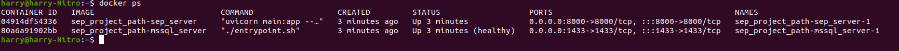
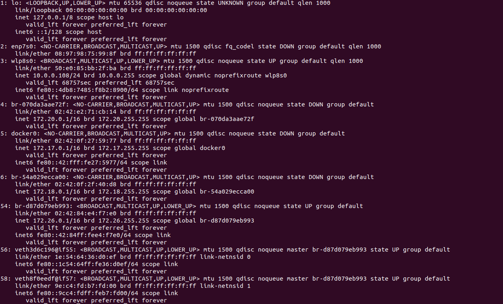

Orchestration of the microservices is achieved through `compose.yaml`

## Installing dependencies

Since we are using `docker` for development and deployment, the only prerequisite is to have `docker`
and `docker compose` installed. Refer to the following links for setup
instructions: [Windows](https://docs.docker.com/desktop/windows/permission-requirements/), [Linux](https://docs.docker.com/desktop/install/linux-install/).
A lot of the following instructions are also very linux centric, so if you are using windows, download wsl2 and install
ubuntu. To download WSL2, go [here](https://learn.microsoft.com/en-us/windows/wsl/install).
After downloading and setting up WSL, you will need to download Ubuntu20.04 from the Microsoft store. If you wish to
interract with the database directly, you will need to use
`sqlcmd`, which you will need to
download [here](https://learn.microsoft.com/en-us/sql/tools/sqlcmd/sqlcmd-utility?view=sql-server-ver16&tabs=odbc%2Clinux).

## Running the server:

Please follow the following steps sequentially:

1. Build image. Will need to rebuild everytime you change any of the file:

```bash
docker compose build
```

2. Run the server:

```bash
docker compose up 
```

Wait for around 5-10s, open another terminal and type:

```bash
docker ps 
```


If you see something similar to the image above, it means that your database server (`sep_project_path-mssql_server`)
and your webserver (`sep_project_path-sep_server`) are available for testing. Note that the name may not be exact

If you want to shut down the servers: 

```commandline
docker compose down
```

## Setup and Debugging

### Get your IP address for connecting with the container:

Type in your terminal (on linux or wsl)

```bash
ip addr
```

You will see something like the image below, which can be overwhelming if you don't know what to look for.



Worry not, here look for entry that begins with `br`, then moves find the one where the state is UP group default. In my
image, the
valid entry is 54, with ip address `172.26.0.1`. If your server is up, you can try the following command:

```commandline
sqlcmd -S 172.26.0.1,1433 -U SA -P Password@123456 -C -d TestDB -Q "SELECT 1"
```

Here 172.26.0.1 is the address you found from previously, and everything else can be kept as is. If it works, you will
see the number 1 printed on the screen.

### Add all the data given by the tutor:

If you want to add the data given by the tutor, or add your own data for testing, this step will be a lot more involved,
so bear with me:

You will first need to install and setup a poetry environment. If you don't have poetry, run

```commandline
pip install poetry 
```

Make sure your local Python version is 3.10. Once the two conditions are fulfilled, run

```commandline
cd src/server
poetry install 
poetry shell
```

This will install all the dependent packages. Then do the following:

```commandline
cd server
```

Here you will see the two files `driver.py` and `InputData.csv`, which is used to mass upload data to the database. To
do this:

```commandline
python driver.py --host=172.26.0.1 --file=InputData.csv
```

Note that if you do this twice for the same data, the second upload will fail because of the constraints set by the
database. This is useful if you want to
quickly populate the database for testing. If you want to mass clean the data, following the steps below. If you want an
API for resetting the db state, let me know.

### Wipe out the database, reset to initial state:

By dy fault, volume data persists in between sessions. This means that if you add data to the database then set up the server 
with `docker compose down`, when setting the server up again with `docker compose up`, you will still see the old data on the server.
If you want a full wipe of the database, 

```commandline
docker compose down -v 
```

Once deleted, you can now run the server backup using the instructions in `Running The Server`